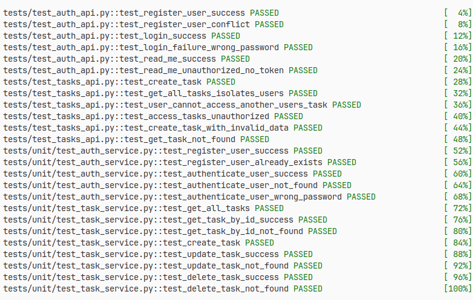
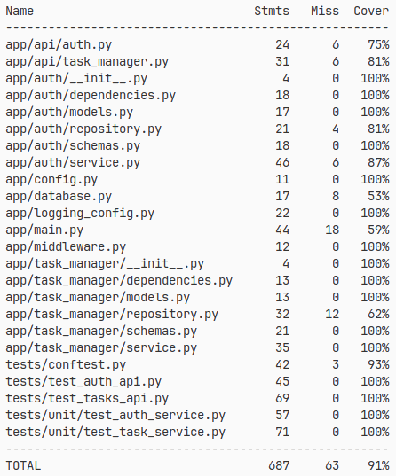

# Task Manager

## Описание

Простой менеджер задач на FastAPI с CRUD операциями.

Асинхронный доступ к БД. Alembic для миграций.

Реализованы основные CRUD-операции по работе с задачами. Добавлены пользователи. Пользователи видят только свои задачи. Создание, чтение, обновление и удаление задач (привязанных к пользователю). Регистрация и аутентификация пользователей (JWT).

Приложение использует дополнительный слой репозитория для освобождения бизнес логики от инфраструктурной зависимости.

Реализован сервисный слой для возможности безболезненного внесения изменений при усложнении бизнес требований.

Логирование в JSON-формате с correlation ID.

Dependency Injection.

Код отформатирован с помощью дефолтных настроек black.

В коде НЕТ абстрактных классов, протоколов. Потому что приложение простое и не требует этих элементов (вспомним принцип YAGNI). При усложнении логики и добавлении классов они будут вводиться.

## Docker

`docker build -t task-manager .`
`docker run -p 8000:8000 --env-file .env task-manager`

## Тестирование

Код готов к тестам на pytest.

Покрытие 91%:

## Запуск

1. Скопируйте .env-example в .env и настройте.
2. Создайте новое окружение `python -m venv .venv` и активируйте его `source ./.venv/vin/activate`.
3. Или с помощью uv: `uv venv`.
4. Установите зависимости: `uv sync --locked` или `pip compile pyproject.toml -o requirements.txt`.
5. Инициализируйте базу данных `alembic upgrade head`
6. Запустите тесты `pytest -vv --cov`
7. Запустите: `uvicorn app.main:app --reload`
8. Swagger: <http://localhost:8000/docs>

## Переход на PostgreSQL

Измените DATABASE_URL в .env на postgresql+asyncpg://...
